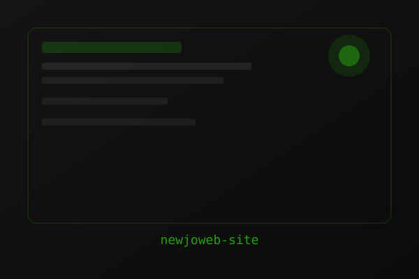
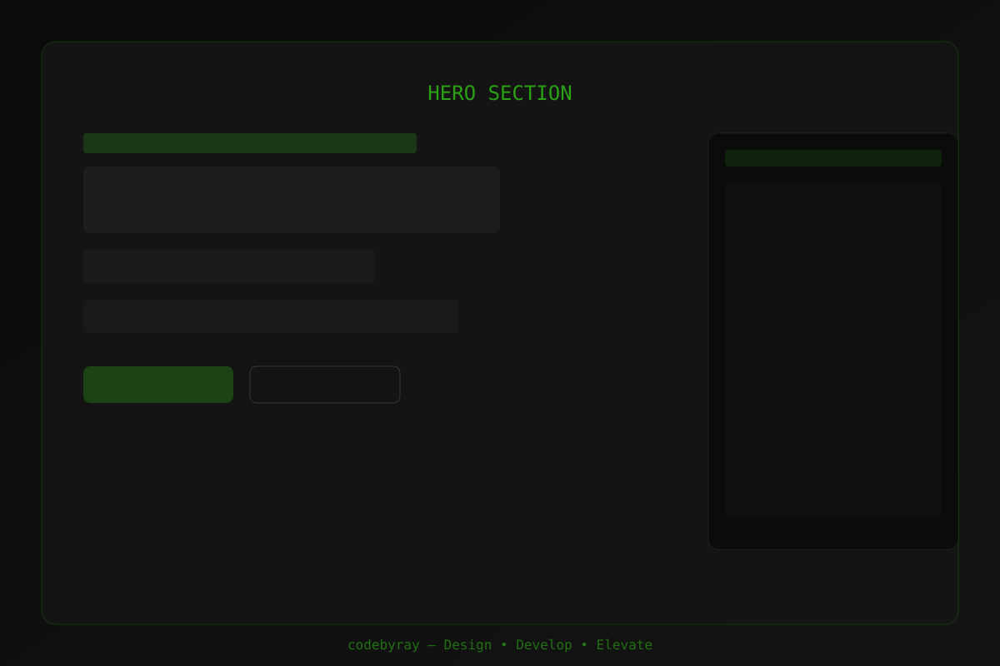
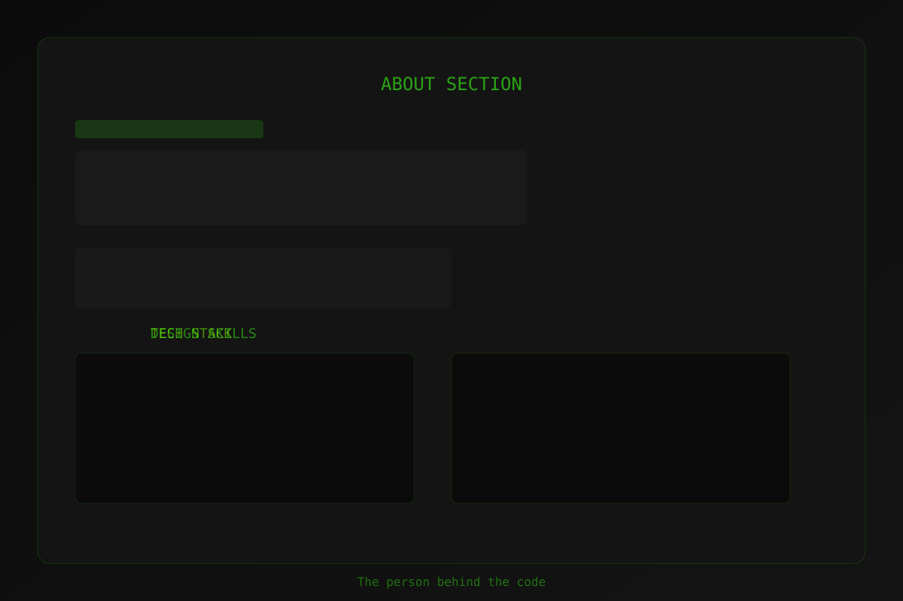
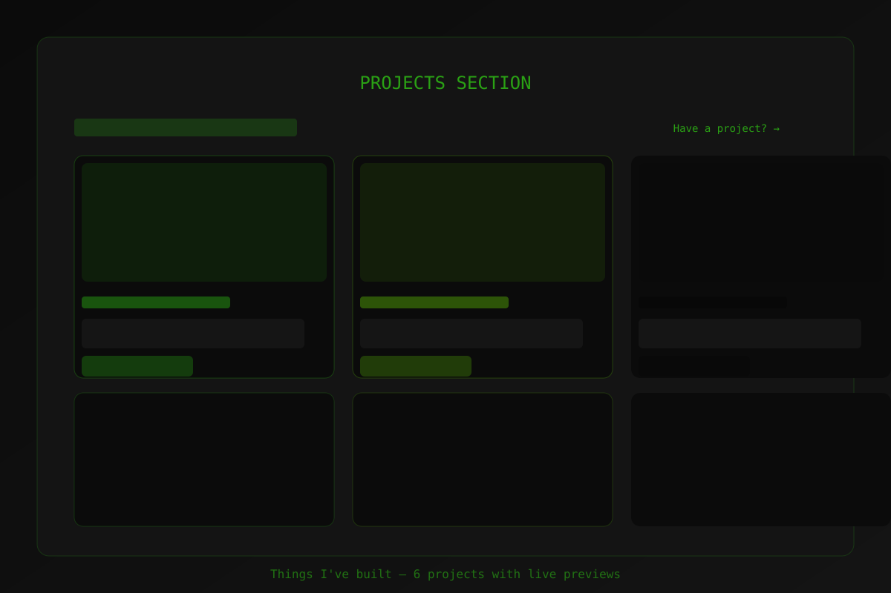
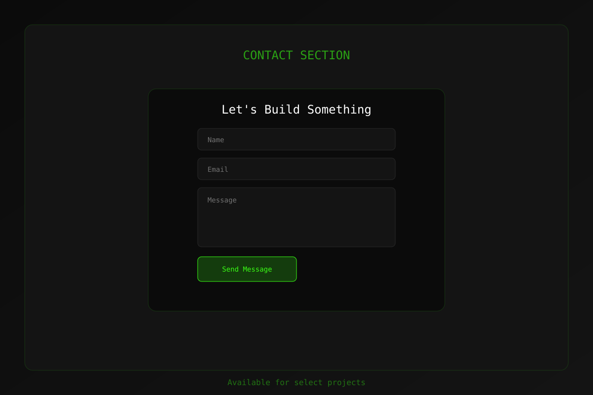

# codebyray — Portfolio

A premium, futuristic portfolio website built with Next.js 15, React 19, and Tailwind CSS. Features smooth animations, a dark neon aesthetic, and interactive project showcases.



## Features

- **Hero Section** — Animated terminal-style intro with role tagline and CTA buttons
- **About** — Skills and tech stack with hover interactions
- **Projects** — 6 real GitHub projects with screenshot previews, tilt hover effects, and direct repo links
- **Process** — 3-step workflow: Design → Develop → Elevate
- **Testimonials** — Client feedback carousel
- **Contact** — Form with validation
- **Navbar** — Smooth scroll navigation with active section highlighting
- **Scroll Progress** — Top bar indicating page scroll position
- **Cursor Glow** — Subtle neon glow following cursor
- **Framer Motion Animations** — Page transitions, scroll reveals, and micro-interactions

## Tech Stack

- **Framework**: Next.js 15 (App Router)
- **Language**: TypeScript
- **Styling**: Tailwind CSS v4
- **Animations**: Framer Motion
- **Icons**: Custom SVG
- **Deployment**: Vercel / Static Export

## Screenshots

| Section | Preview |
|---------|---------|
| **Hero** |  |
| **About** |  |
| **Projects** |  |
| **Process** |  |
| **Contact** |  |

*Project card screenshots are located in `public/screenshots/`*

## Getting Started

```bash
# Install dependencies
npm install

# Run development server
npm run dev

# Build for production
npm run build

# Preview production build
npm run start

# Static export (outputs to /out)
npm run build && npm run export
```

## Project Structure

```
src/
├── app/
│   ├── globals.css      # Global styles & Tailwind
│   ├── layout.tsx       # Root layout with metadata
│   └── page.tsx         # Home page composition
├── components/
│   ├── sections/        # Page sections (Hero, About, Projects, etc.)
│   └── ui/              # Reusable UI components (Odometer, GlitchText, etc.)
└── lib/
    └── utils.ts         # Utility functions (cn helper)
public/
├── screenshots/         # Project preview images (SVG placeholders)
└── og.svg               # Open Graph image
```

## Customization

### Update Projects
Edit `src/components/sections/Projects.tsx` — modify the `PROJECTS` array:

```ts
const PROJECTS: Project[] = [
  {
    title: "Your Project",
    tag: "Category",
    description: "Description...",
    tech: ["React", "TypeScript"],
    year: "2024",
    href: "https://github.com/your/repo",
    accent: "from-[#39FF14]/40 to-transparent",
    image: "/screenshots/your-project.svg",
  },
  // ...
];
```

Add your screenshot to `public/screenshots/` (same filename as `image` path).

### Colors
Primary accent colors defined in `globals.css`:
- `#39FF14` — Neon Green (primary)
- `#7CFF00` — Lime Green (secondary)

## Deployment

### Vercel (Recommended)
1. Push to GitHub
2. Import project in Vercel
3. Deploy — zero config needed

### Static Export
```bash
npm run build
# Output in /out directory — deploy to any static host
```

## License

MIT — feel free to use as a template for your own portfolio.

---

Built with care by [Ray](https://github.com/rayomesh9-star)